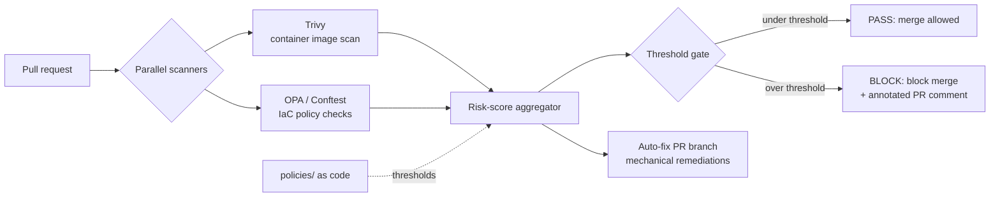

# pipeline-guard

**A shift-left security gate for CI: it scans container images and IaC in parallel on every PR, scores the findings, and blocks the merge - with an auto-fix branch for the mechanical stuff.**


## The problem

Vulnerable base images and misconfigured infrastructure-as-code - open security groups, public buckets, missing encryption, over-permissive IAM - slip through review constantly, because human reviewers aren't scanners and "looks fine" is not a control. By the time these reach production they're incidents. Teams want the check to happen automatically, before merge, and to fail loudly with a fix rather than a wall of raw scanner output.

`pipeline-guard` is that gate. On every pull request it runs multiple scanners in parallel, normalizes and risk-scores the results against a policy you control, and **blocks the merge** when the risk crosses your threshold - posting an annotated PR comment that explains exactly what failed and why, and opening an auto-fix branch for the remediations that are mechanical.

## Architecture



## Quick start

Requires Python 3.11+. Runs fully offline against bundled fixtures - no cloud, no secrets.

```bash
pip install -r requirements.txt      # or: pip install -e .

# Run the test suite (65 tests)
python -m pytest -q

# Scan the bundled sample image report + Terraform/K8s fixtures
python -m pipeline_guard scan --fixtures fixtures/ --policy policies/

# Show what would block a merge, with the annotated report
python -m pipeline_guard report --format markdown
```

Drop it into a repo as a GitHub Action via the included `action.yml`.

## How it works

- **Scanner adapters** (`src/pipeline_guard/scanners/`) normalize Trivy image findings and OPA/Conftest policy results (Terraform + Kubernetes) into one shared finding model - adding a scanner is one adapter, nothing downstream changes.
- **Policy as code** (`policies/`) defines severity weights and the block threshold, so "what counts as a failing PR" is versioned and reviewable, not hardcoded.
- **Aggregator** combines findings into a single risk score and a pass/block decision.
- **Reporting** renders a human-readable, annotated PR comment (not raw JSON).
- **Auto-fix** opens a branch with the mechanical remediations (e.g. pinning a base image, tightening an obvious misconfig).
- **CI**: `.github/workflows/ci.yml` runs the full suite on every push.

## Tech

Python | Trivy | Open Policy Agent / Conftest | GitHub Actions | Docker

## Maintainer

This project is maintained by Yeshwanth Reddy Aleti.

Yeshwanth is a Network Engineer with over 4 years of experience specializing in the design, implementation, and security of enterprise network infrastructures. With a professional background spanning financial services and global enterprise environments, he focuses on strengthening security compliance and optimizing network operations through automation and proactive monitoring. His expertise includes Python, PowerShell, and Bash for infrastructure lifecycle management and cloud networking.

**Contact Information:**
- Email: yeshwanth.ra61@gmail.com
- GitHub: https://github.com/
- LinkedIn: https://linkedin.com/in/